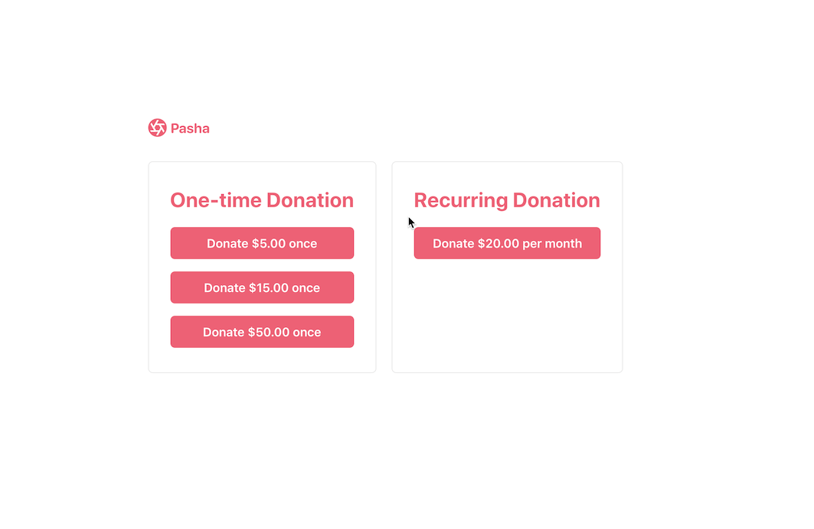

# GitHub Payment Pages with Stripe Checkout

This is an example of a client-only (server-free) donation payment page that can be hosted on GitHub using Stripe Checkout.

You can see this repository running on [GitHub Pages](https://pages.github.com/) here: https://stripe-samples.github.io/github-pages-stripe-checkout

## Setup

- Create Stripe Account: https://dashboard.stripe.com/register
- Enable client-only checkout: https://dashboard.stripe.com/account/checkout/settings
- Create a one-time or recurring product in the Stripe Dashboard: https://dashboard.stripe.com/products
  - After creation click the "Use with checkout" button and copy the price ID
  - Paste the IDs into the button `data-price-id` attributes.
- Copy your publishable key from: https://dashboard.stripe.com/apikeys and set it as the value for `PUBLISHABLE_KEY` in the index.html file

## Run locally

Since these are all static assets you can serve them locally with a simple web server, e.g.

Python 2

    python -m SimpleHTTPServer 8888

Python 3

    python -m http.server 8888

You can now view your page at http://localhost:8888

If you're getting an error running this command, see more detailed insturctions on [MDN](https://developer.mozilla.org/en-US/docs/Learn/Common_questions/set_up_a_local_testing_server).

## Go live

- Add `username.github.io` (replace username with your github user name) to the domain whitelist in https://dashboard.stripe.com/account/checkout/settings
- Replace the test publishable key `PUBLISHABLE_KEY` in the index.html file with your pk\*live_xxx key which can be found here: https://dashboard.stripe.com/test/apikeys (!!!**NOTE**!!!: never paste in your secret key! For client-only Checkout only the publishable key is needed!)
- Commit the changes to the `gh-pages` branch and push them to GitHub.
- Done, you can now accept live payments on your GitHub pages \o/

## More Checkout Samples

- [checkout-one-time-payments](https://github.com/stripe-samples/checkout-one-time-payments)
- [checkout-single-subscription](https://github.com/stripe-samples/checkout-single-subscription)

## FAQ

Q: Why did you pick these frameworks?

A: We chose the most minimal framework to convey the key Stripe calls and concepts you need to understand. These demos are meant as an educational tool that helps you roadmap how to integrate Stripe within your own system independent of the framework.

## Get support
If you found a bug or want to suggest a new [feature/use case/sample], please [file an issue](../../issues).

If you have questions, comments, or need help with code, we're here to help:
- on [Discord](https://stripe.com/go/developer-chat)
- on Twitter at [@StripeDev](https://twitter.com/StripeDev)
- on Stack Overflow at the [stripe-payments](https://stackoverflow.com/tags/stripe-payments/info) tag
- by [email](mailto:support+github@stripe.com)

Sign up to [stay updated with developer news](https://go.stripe.global/dev-digest).

## Author(s)

- [@adreyfus-stripe](https://twitter.com/adrind)
- [@thorsten-stripe](https://twitter.com/thorwebdev)
